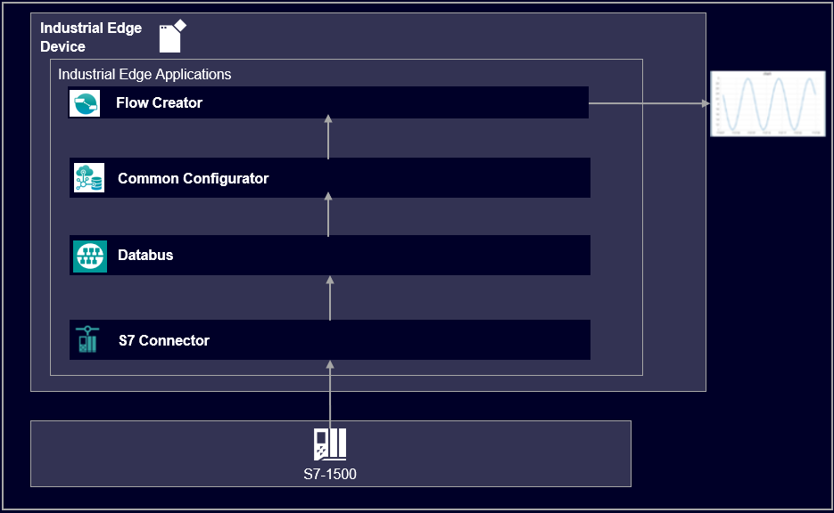
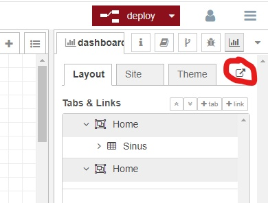
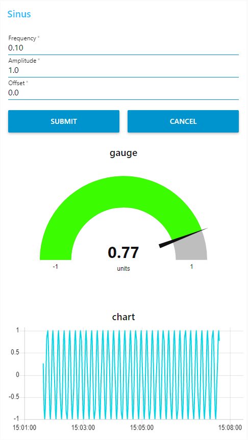

# S7 Connector Data Handling Getting Started

This repository contains the source files to build the Simatic S7 Connector Data Handling Getting Started example.

- [S7 Connector Data Handling Getting Started](#s7-connector-data-handling-getting-started)
  - [Description](#description)
    - [Overview](#overview)
    - [General task](#general-task)
  - [Requirements](#requirements)
    - [Prerequisites](#prerequisites)
    - [Used components](#used-components)
    - [Further requirements](#further-requirements)
    - [TIA Project](#tia-project)
  - [Configuration steps](#configuration-steps)
  - [Usage](#usage)
  - [Implementation](#implementation)
  - [Documentation](#documentation)
  - [Contribution](#contribution)
  - [License and Legal Information](#license-and-legal-information)
  - [Disclaimer](#disclaimer)

## Description

### Overview

This application example describes the implementation and usage of the Flow Creator using the example of a sinusoidal wave.

### General task

The application read and write some data of the PLC. The data is published via SIMATIC S7 Connector and Databus where the Flow Creator can retrieve the data. First, the SIMATIC S7 Connector, Common Configurator needs to be configured. Afterwards it is possible to subscribe the different topics in the Flow Creator and edit, filter and display the messages which obtain the PLC Data information. The data can be visualized with different graphics such as charts, gauge or forms.

## Requirements

###  Prerequisites

- Access to an Industrial Edge Management System (IEM)
- Onboarded Industrial Edge Device on IEM
- Installed System Configurators for Databus and SIMATIC S7 Connector
- Installed System Apps Databus and SIMATIC S7 Connector
- Installed Apps common configurator
- Edge device is connected to PLC
- TIA portal project loaded on PLC (e.g. for HowTos_Sinus_Wave application)

### Used components

- Industrial Edge Management V1.13.10/Kubernetes
  - Databus V2.2.0-3
  - Databus Configurator V2.3.1-4
  - Common import converter V2.0.0-1
  - Registry Service V1.8.0-2
  - Flow Creator V1.15.0
  - IIH Essentials V1.8.1 
  - Common Configurator V1.9.0-4
  - SIMATIC S7 Connector V2.0.0-1
- Industrial Edge Device V1.16.0-1-a-rc1
- TIA Portal V18
- S7-1500 (PLC)
- Web browser (Mozilla or Chrome)

### Further requirements

- IE Device is onboarded to a Industria Edge Management
- Databus Configurator is deployed to the IE Management
- Databus is deployed to the IE Device
- S7 connector configured via Common configurator 
- Flow Creator is deployed to the IE Device

### TIA Project

The used TIA Portal project can be found in the [src](src) -file under the following name and is also used for several further application examples:

- [HowTos_Sinus_Wave.7z](src/HowTos_Sinus_Wave.7z)

## Configuration steps

You can find the further information about the following steps in the [docs](docs/Installation.md)
- Configure PLC Connection
- Configure Flow Creator

## Usage

Once the application is successfully deployed, the sinus wave can be deployed in the web UI of the Flow Creator. The sinus parameters such as frequency, amplitude or offset can be controlled in the web UI. The web UI can be accessed via the button in the upper right corner. With the submit button the set parameters from above will be written into the PLC. The sinus can be viewed in the chart below.

## Implementation
A detailed description of the implementation of the project can be found in the [implementation](docs/Implementation.md) file

## Documentation
 
- You can find further documentation and help in the following links
  - [Industrial Edge Hub](https://iehub.eu1.edge.siemens.cloud/#/documentation)
  - [Industrial Edge Forum](https://forum.mendix.com/link/space/industrial-edge)
  - [Industrial Edge landing page](https://new.siemens.com/global/en/products/automation/topic-areas/industrial-edge/simatic-edge.html)
  - [Industrial Edge GitHub page](https://github.com/industrial-edge)
  - [Industrial Edge documentation page](https://docs.eu1.edge.siemens.cloud/index.html)
  
## Contribution

Thank you for your interest in contributing. Anybody is free to report bugs, unclear documentation, and other problems regarding this repository in the Issues section.
Additionally everybody is free to propose any changes to this repository using Pull Requests.

If you are interested in contributing via Pull Request, please check the [Contribution License Agreement](Siemens_CLA_1.1.pdf) and forward a signed copy to [industrialedge.industry@siemens.com](mailto:industrialedge.industry@siemens.com?subject=CLA%20Agreement%20Industrial-Edge).

## License and Legal Information

Please read the [Legal information](LICENSE.txt).

## Disclaimer

IMPORTANT - PLEASE READ CAREFULLY:

This documentation describes how you can download and set up containers which consist of or contain third-party software. By following this documentation you agree that using such third-party software is done at your own discretion and risk. No advice or information, whether oral or written, obtained by you from us or from this documentation shall create any warranty for the third-party software. Additionally, by following these descriptions or using the contents of this documentation, you agree that you are responsible for complying with all third party licenses applicable to such third-party software. All product names, logos, and brands are property of their respective owners. All third-party company, product and service names used in this documentation are for identification purposes only. Use of these names, logos, and brands does not imply endorsement.
