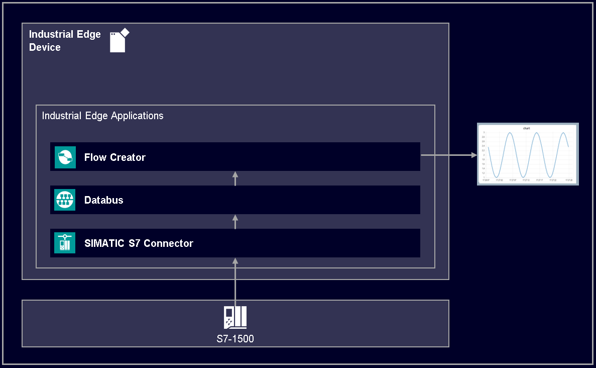
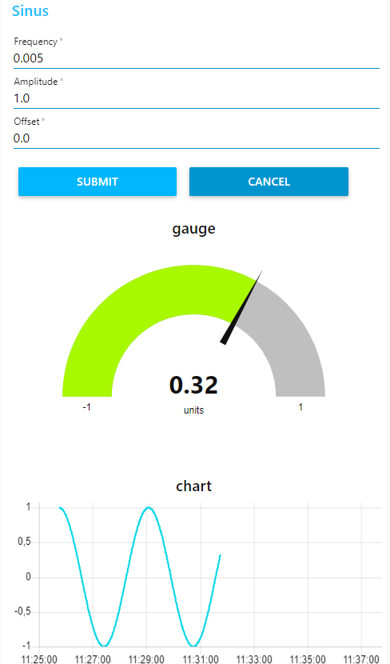

# S7 Connector Data Handling Getting Started

This repository contains the source files to build the S7 Connector Data Handling Getting Started example.

- [S7 Connector Data Handling Getting Started](#s7-connector-data-handling-getting-started)
  - [Description](#description)
    - [Overview](#overview)
    - [General task](#general-task)
  - [Requirements](#requirements)
    - [Prerequisites](#prerequisites)
    - [Used components](#used-components)
    - [Further requirements](#further-requirements)
    - [TIA Project](#tia-project)
  - [Configuration steps](#configuration-steps)
  - [Usage](#usage)
  - [Implementation](#implementation)
  - [Documentation](#documentation)
  - [Contribution](#contribution)
  - [License and Legal Information](#license-and-legal-information)

## Description

### Overview

This application example describes the implementation and usage of the IE Flow Creator using the example of a sinusoidal wave. 

### General task

The application read and write some data of the PLC. The data is published via Simatic S7 Connector and IE Databus where the IE Flow Creator can retrieve the data. First, the Simatic S7 Connector and the IE Databus must be configured. Afterwards it is possible to subscribe the different topics in the IE Flow Creator and edit, filter and display the messages which obtain the PLC Data information. The data can be visualized with different graphics such as charts, gauge or forms.

## Requirements

###  Prerequisites

- Access to an Industrial Edge Management System (IEM)
- Onboarded Industrial Edge Device on IEM
- Installed System Configurators for IE Databus and Simatic S7 Connector
- Installed System Apps IE Databus and Simatic S7 Connector
- Installed Apps IE Flow Creator
- Edge device is connected to PLC
- TIA portal project loaded on PLC (e.g. for filling application)

### Used components

- Industrial Edge Management V 1.2.0-36
  - IE Databus V1.2.16
  - IE Databus Configurator V1.2.29
  - IE Flow Creator V 1.1.2
  - Simatic S7 Connector Configurator V1.2.38
  - Simatic S7 Connector V1.2.26
- Industrial Edge Device V 1.2.0-56
- TIA Portal V16
- S7-1511C
- Web browser (Mozilla or Chrome)

### Further requirements

- IE Device is onboarded to a IE Management
- IE Databus Configurator is deployed to the IE Management
- IE Databus is deployed to the IE Device
- IE Flow Creator is deployed to the IE Device

### TIA Project

The used TIA Portal project can be found in the [src](src) -file under the following name and is also used for several further application examples:

- [HowTos_Sinus_Wave.7z](src/HowTos_Sinus_Wave.7z)

## Configuration steps

You can find the further information about the following steps in the [docs](docs/Installation.md)
- Configure PLC Connection
- Configure IE Flow Creator

## Usage

Once the application is successfully deployed, the sinus wave can be deployed in the web UI of the IE Flow Creator. The sinus parameters such as frequency, amplitude or offset can be controlled in the web UI. The web UI can be accessed via the button in the upper right corner. With the submit button the set parameters from above will be written into the PLC. The sinus can be viewed in the chart below.

## Implementation
A detailed description of the implementation of the project can be found in the [implementation](docs/Implementation.md) file

## Documentation
  
You can find further documentation and help in the following links

- [Industrial Edge Hub](https://iehub.eu1.edge.siemens.cloud/#/documentation)
- [Industrial Edge Forum](https://www.siemens.com/industrial-edge-forum)
- [Industrial Edge landing page](https://new.siemens.com/global/en/products/automation/topic-areas/industrial-edge/simatic-edge.html)
- [Industrial Edge GitHub page](https://github.com/industrial-edge)
  
## Contribution

Thank you for your interest in contributing. Anybody is free to report bugs, unclear documentation, and other problems regarding this repository in the Issues section.
Additionally everybody is free to propose any changes to this repository using Pull Requests.

If you are interested in contributing via Pull Request, please check the [Contribution License Agreement](Siemens_CLA_1.1.pdf) and forward a signed copy to [industrialedge.industry@siemens.com](mailto:industrialedge.industry@siemens.com?subject=CLA%20Agreement%20Industrial-Edge).

## License and Legal Information

Please read the [Legal information](LICENSE.md).
