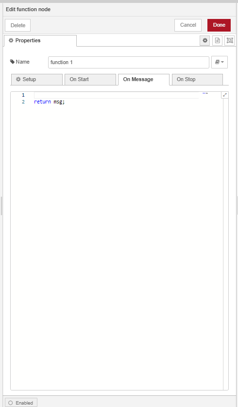
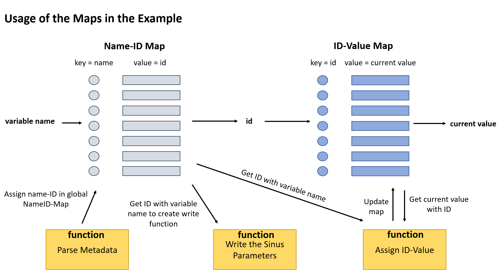

# Implementation

- [Implementation](#implementation)
  - [The Flow Creator](#the-flow-creator)
    - [Subscribe a MQTT-Topic](#subscribe-a-mqtt-topic)
    - [Send an MQTT-Message to write Data](#send-an-mqtt-message-to-write-data)
    - [Create a Function](#create-a-function)
    - [Debug the Messages](#debug-the-messages)
    - [Create Line Diagram](#create-line-diagram)
    - [Create Gauge Diagram](#create-gauge-diagram)
    - [Create a Form](#create-a-form)
    - [Dashboard](#dashboard)
    - [Data Handling](#data-handling)
      - [Code Snipes](#code-snipes)
        - [Parse Metadata](#parse-metadata)
        - [Asign ID-Value](#asign-id-value)
    
## The Flow Creator

### Subscribe a MQTT-Topic
Using the "mqtt-in" node makes it possible to receive the published MQTT-Messages from the SIMATIC S7 Connector. In the configuration of the "mqtt-in" node, the subscribed mqtt-topic must be specified. `"ie/#"` subscribes all the messages from the configured Databus. It is also possible to set the output type of the node (String, buffered, JSON, base64 encoded String) in the configuration.


To save the changes and establish a connection press the deploy button in the left corner. At the beginning, after the establishment of the connection, the SIMATIC S7 Connector will publish a message with meta data. This message contains an array with all the connections and the different datapoints of these connections. All the datapoints have a name and an ID. The ID of a data point does not necessarily always remain the same. With same changes (for example in the TIA-Project) the ID can change.


In the following messages the distinction between the datapoints can only be made by the ID. So, it is necessary to save the assignment between name and ID for the processing of the messages. In this example this is realized with a HashMap, in which the name acts as key and the ID as value. With this HashMap it is always possible to get the right ID to the variable name. More details information can be found under [Data Handling](#data-handling).

By change of a subscribe variable, the SIMATIC S7 Connector send another MQTT-messages which includes an Array with all changed variables. The information of the datapoint include the ID, timestamp and current value.


### Send an MQTT-Message to write Data

It is also possible to write PLC variables with the mqtt-out node. To do this, the data must be converted to JSON format using a function and then be published under the write topic.


For a successful writing process, the outgoing MQTT-message must contain the sequence number ("seq") and an array ("vals") which contains the information to the datapoints which are intended to be written. For each datapoint the corresponding ID and the value to be written must be specified. 
In the example, the frequency, amplitude and offset should be written according to the user input. For this purpose, the correct ID from the meta data must be reassigned. This is realized with the global HashMap, which is produced with the incoming of the meta data message.

```js
msg.payload = 
{
    "seq": 1,
    "vals": [
        {
        "id": nameIDMap.get("Frequency"),       
        "val": Number(freq)
        },
        {
        "id": nameIDMap.get("Amplitude"),       
        "val": Number(amp)
        },
        {
        "id": nameIDMap.get("Offset"),          
        "val": Number(off)
        }
    ]
}
```

### Create a Function

With functions the data from the messages can be filtered to the important information and be processed. A function gets a message as input and can send one or more messages as output. The number of outputs can be set in the settings of the function node. The function node contains of three parts: the setup part, the function part and the close part. The code in the setup part will run whenever the node is started while the code in the close part runs when the node stops. Every time when the function node receives a new message the code under the function tab is executed. This is the position where the code to filter and process the message will be inserted. The program language of the function is JavaScript.



The desired information about the connection and the data points can be filtered out of the input message. The elements of the JSON-Messages can be accessed via **"."** (i.e. **msg.payload** provides the payload of the message). If the Payload contains an array of element, in example values (vals), it is also possible to iterate through this array. The following graphic shows an example how to read variable values from the message and write them in a HashMap.

```js
  if(m.vals != undefined)
  {
      //write the recieved Values into the Map (key = id)
      m.vals.forEach(value => {
          idValueMap.set(value.id, value.val);
          ...  
      });
      ...
  }

```


Sometimes it is necessary to store data in a global variable. In the case of the example the HashMap’s which include the assignment from Name to ID and the HashMap which stores the current values of the datapoints are global, so that they can be accessed in all functions of the Flow.

Data can be stored globally with the instruction **"globale.set("Variable1", variable1)"**. With the instruction **"globale.get("Variable1")"** these can be read out again afterwards.  The following code snipes shows the handling the the global variables in the sample.

```js
/*################################# 
    Init Maps
#################################*/
  let nameIDMap = new Map();
  let idValueMap = new Map();    
```

```js
  /*################################# 
    update global maps
  #################################*/  
  global.set("IDValueMap", idValueMap);
  global.set("timestampMapObject", timestampMapObject);
```

```js
  /*################################# 
    get global Maps
  #################################*/
  let nameIDMap = global.get("NameIDMap");
  let idValueMap = global.get("IDValueMap");
```

### Debug the Messages
Debugging is possible with the debugging node. This allows to view the messages in the debugging window.


### Create Line Diagram
After filter the required current values of the PLC out of the MQTT-Messages of the SIMATIC S7 Connector Apps, it is possible to plot the values. It is also necessary to assign the diagrams to a group in which they will be displayed.


### Create Gauge Diagram
An extra node is available for displaying the data in the gauge diagram. Again the group in which it will be displayed, must be selected. With the help of a function, the minimum and maximum values of the range can dynamically be changed. The associated code can be as followed.

```js
  var max = (Number(msg.payload.Amplitude) + Number(msg.payload.Offset));
  var min = max * (-1);

  msg = {ui_control:{min:min,max:max}}

  return msg; 
```

### Create a Form
With the form node it is possible to enter parameters in the dashboard. These values can be used for example to control the PLC variables. In the settings it is possible to set whether the parameter is optional or must be entered. After confirming the input at the dashboard, the from node send a message with JSON Object including the set names of the set parameters and its values.


### Dashboard
The diagrams as well as the form for controlling the PLC variables are displayed in the dashboard. The configuration of the dashboard can be done under the dashboard tab. There is also a link to the dashboard.


### Data Handling
The biggest challenge of the example was to handle and assign the datapoint metadata flexibly. In other words, it is possible to query at any time which variable has which ID and which value. For this purpose, two global HashMaps have been created. One HashMap (NameIDMap) stores the ID that is associated to the variable name. This information is sent with the meta data. The other HashMap (IDValueMap) stores the current values that are associated to the ID. This information is always sent whenever the variable value changes.

With the help of both global HashMaps it is always possible to assign the ID and thus the current value to the name (i. e. _IDValueMap.get(NameIDMap.get("frequency")_) --> gets the current value of the variable frequency). The following graphic should clarify the procedure and shows where which HashMap’s are used and how.




#### Code Snipes

##### Parse Metadata
assign Name to ID.
(create HashMaps, assign Name-ID and set HashMap’s global)

```js
  /*################################# 
      Init Variables
  #################################*/
  let nameIDMap = new Map();          //global only changed here
  let connectionName = "opcuaSinus"; // Name of the connection
```

```js
  // Iterate through connections
  m.connections.forEach(connection => 
  {
      if ((connection.name == connectionName)) {
          let dataPoints = connection.dataPoints;

          //  Iterate through dataPoints
          dataPoints.forEach( dataPoint => {
              let dataPointDefinitions = dataPoint.dataPointDefinitions;

              // Iterate through dataPointDefinitions
              dataPointDefinitions.forEach(dataPointDefinition => {
                  nameIDMap.set(dataPointDefinition.name, dataPointDefinition.id);
              });
          });
      }
  });
```

```js
  /*################################# 
      update global maps
  #################################*/  
  global.set("NameIDMap", nameIDMap);
```


##### Asign ID-Value
**assign ID to the Value**
(get global Variables, filter incoming message and write in Map, get the value to be displayed, save Map)

```js
  /*################################# 
      Init Variables
  #################################*/
  let nameIDMap = global.get("NameIDMap");      
  let idValueMap = global.get("IDValueMap");  
```

```js
  m.vals.forEach(value => {
          idValueMap.set(value.id, value.val);

          //only send message when sinus value is sent
          if(value.id == nameIDMap.get(variableName))
          {
              //get the id of the sinusVariable and get with this id the current value
              new_message=1;
              msg.payload=idValueMap.get(nameIDMap.get(variableName));
          }
```

```js
  /*################################# 
    update global maps
  #################################*/  
  global.set("IDValueMap", idValueMap);
```

**store the timestamp:**
Sometimes e.g. when writing the databases, the timestamp is needed in addition to the current value. So that this information is available at any time, the timestamp and the idValueMap is stored in a global JSON object.

```js   
  let timestampMapObject = {};
```

```js
  timestampMapObject =
      {
          "ts": timestamp,
          "map": idValueMap
      }
```

The following code snippet shows how to get the desired information from the written JSON-object

```js
  let timestampMapObject = global.get("timestampMapObject");
  let nameIDMap = global.get("NameIDMap");  

  //let object = timestampMapObject.
  let newMsg = { payload: msg.payload.length };

  msg.payload = timestampMapObject.ts;

  newMsg.payload = timestampMapObject.map.get(nameIDMap.get("sinusVal"))

  return [msg,newMsg];
```

**Getting the Names of the changed Variables** is possible with injecting following code to the assign ID-Value function

```js
  let changedVariables = new Array();
  const iterator1 = nameIDMap.keys(); 
```

```js
  m.vals.forEach(value => {
    idValueMap.set(value.id, value.val);

    //filter which variable changed
    for(let i = 0; i < nameIDMap.size; i++)
    {
        name = iterator1.next().value
        if(nameIDMap.get(name) == value.id) {
            changedVariables.push(name);
        }
    }
  }
```


