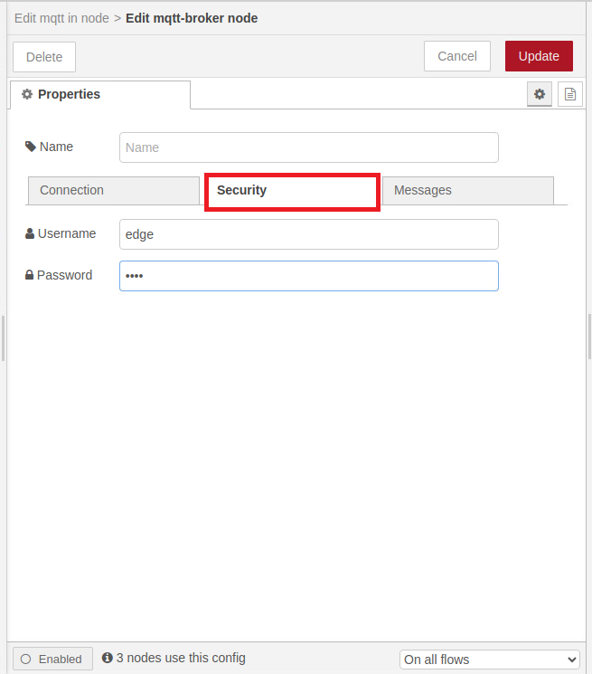

# Configuration

- [Configuration](#configuration)
  - [Configure PLC Connection](#configure-plc-connection)
    - [Configure the Databus](#configure-the-databus)
    - [Configure the SIMATIC S7 Connector](#configure-the-simatic-s7-connector)
  - [Configure Flow Creator](#configure-flow-creator)

## Configure PLC Connection

To read data from the PLC and provide the data, we will use the SIMATIC S7 Connector to establish connection with the PLC via S7.

The SIMATIC S7 sends the data to the Databus, where the Flow Creator app can collect what is needed.

In order to build this infrastructure, these apps must be configured properly:

- Databus
- SIMATIC S7 Connector

### Configure the Databus

In your IEM open the Databus and launch the configurator.

Add a user with this topic:
`"ie/#"`

Deploy the configuration.

### Configure the SIMATIC S7 Connector 

Simatic S7 Connector can be configured via both bellow mentioned options

###### a) Local configuration with Industrial edge device

###### b) Central configuration with Industrial edge management 

#### Local Configuration

In your Industrial edge device open the common configurator and configure the S7 connector

This Configuration done locally at the Industrial edge Device

Add a data source:

Add a data Databus credentials in common configurator:

Hint: Username and password should be the same as was set in the Databus configuration, e.g., "edge" / "edge".

Click save.

export the S7.zip file from TIA portal by using export SCADA simatic tool:

Download the SCADA simatic tool from siemens site for TIA portal:

 

Import the tags to S7 connector from S7.zip file exported from TIA portal
 

Add select these four tags Frequency, Offset, Amplitude, SinusVal with 1 sec of acquisition cycle and click import (since we want to write variable values into the PLC, set "Read & Write" as access mode): 

And click deploy 

>Hint! Please use the same variable names as shown in the screenshot, otherwise the flow creator script must be adjusted.

#### Central Configuration

In your IEM open the data connection and click the SIMATIC S7 Connector.

Launc the S7 connector to your device

This configuration done centrally at IEM 

Add a data source:

Browse the tags from PLC 

Add these four tags Frequency, Offset, Amplitude, SinusVal with 1 sec of acquisition cycle (since we want to write variable values into the PLC, set "Read & Write" as access mode):   

Edit the settings:

Hint: Username and password should be the same as was set in the Databus configuration, e.g., "edge" / "edge".

## Configure Flow Creator

Open the Flow Creator App from the IED Web UI and import the [FlowCreator.JSON](../src/FlowCreator.json) file from the source folder.

After importing the JSON file, the password set in the Databus must be entered in the security settings of the MQTT-node.

Hint: Username and password should be the same , e.g., "edge" / "edge".

