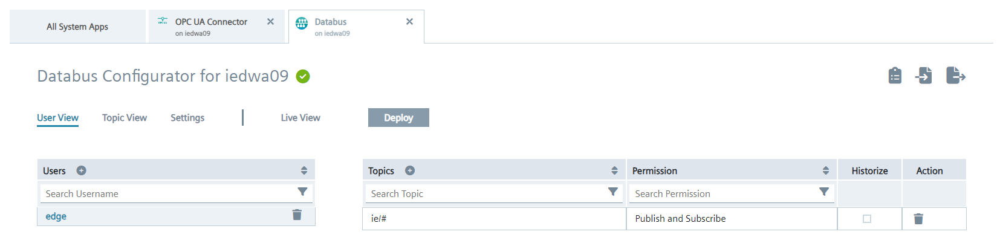
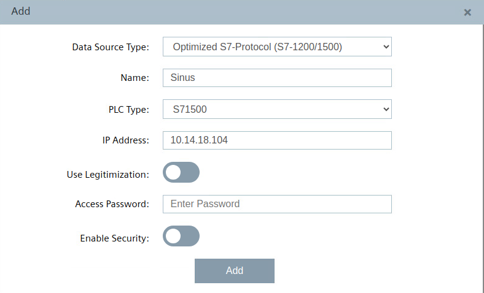

# Configuration

- [Configuration](#configuration)
  - [Configure PLC Connection](#configure-plc-connection)
    - [Configure the IE Databus](#configure-the-ie-databus)
    - [Configure the Simatic S7 Connector](#configure-the-simatic-s7-connector)
  - [Configure IE Flow Creator](#configure-ie-flow-creator)

## Configure PLC Connection

To read data from the PLC and provide the data, we will use the Simatic S7 Connector to establish connection with the PLC via OPC UA.

The Simatic S7 Connector sends the data to the IE Databus, where the IE Flow Creator app can collect what is needed.

In order to build this infrastructure, these apps must be configured properly:

- IE Databus
- Simatic S7 Connector

### Configure the IE Databus

In your IEM open the IE Databus and launch the configurator.

Add a user with this topic:
`"ie/#"`

Deploy the configuration.

### Configure the Simatic S7 Connector

In your IEM open the Simatic S7 Connector and launch the configurator.

Add a data source:

Add needed tags (since we want to write variable values into the PLC, set "Read & Write" as access mode): 

Please use the same variable names as shown in the screenshot, otherwise the flow creator script must be adjusted.

Edit the settings:

Hint: Username and password should be the same as was set in the IE Databus configuration, e.g., "edge" / "edge".

Deploy and start the project.

## Configure IE Flow Creator

Open the IE Flow Creator App from the IED Web UI and import the [FlowCreator.JSON](src/FlowCreator.JSON) file from the source folder.

After importing the JSON file, the password set in the IE Databus must be entered in the security settings of the MQTT-node.

