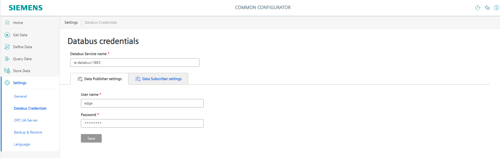
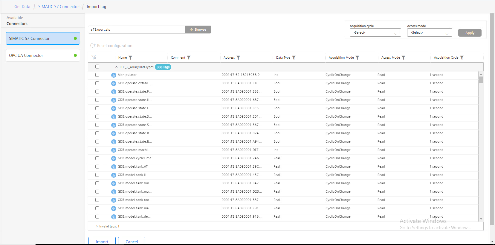
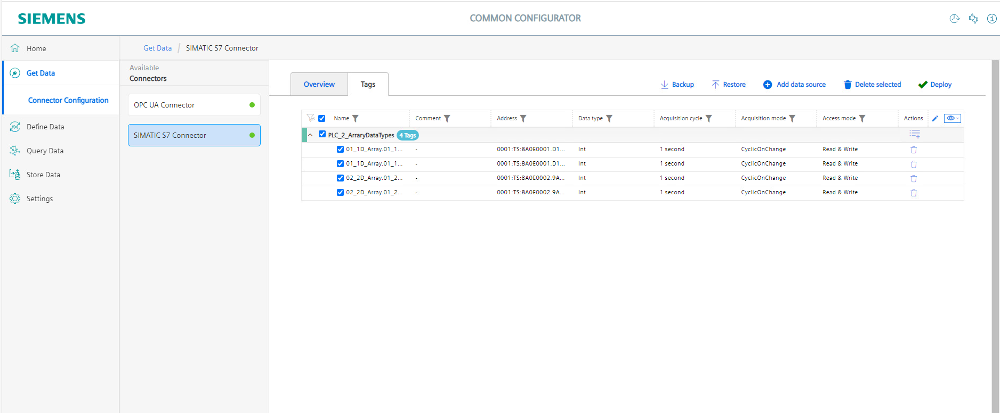
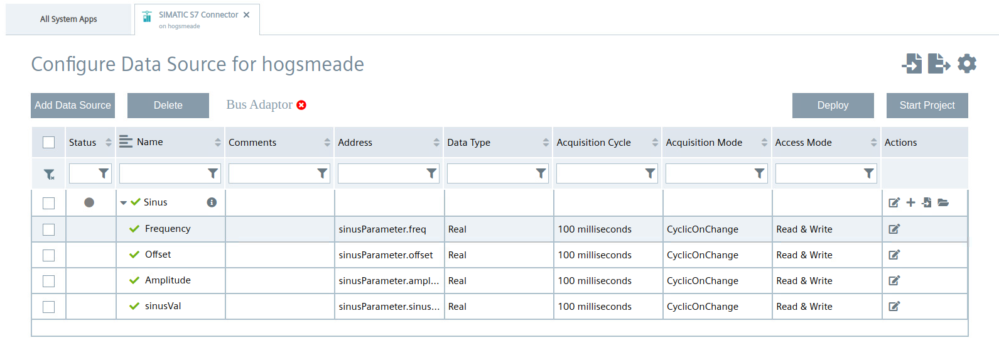
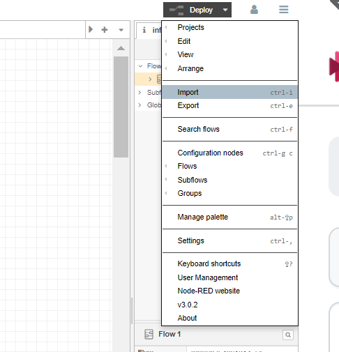
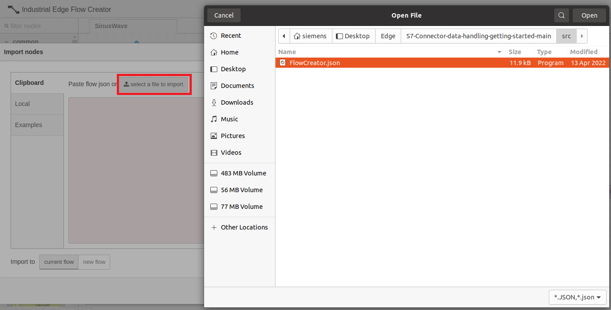

# Configuration

- [Configuration](#configuration)
  - [Configure PLC Connection](#configure-plc-connection)
    - [Configure the Databus](#configure-the-databus)
    - [Configure the SIMATIC S7 Connector at IE Device](#configure-the-simatic-s7-connector-at-IE-Device)
    - [Configure the SIMATIC S7 Connector with IEM](#configure-the-simatic-s7-connector-with-IEM)
  - [Configure Flow Creator](#configure-flow-creator)

## Configure PLC Connection

To read data from the PLC and provide the data, we will use the SIMATIC S7 Connector to establish connection with the PLC via S7.

The SIMATIC S7 sends the data to the Databus, where the Flow Creator app can collect what is needed.

In order to build this infrastructure, these apps must be configured properly:

- Databus
- SIMATIC S7 Connector

### Configure the Databus

In your IEM open the Databus and launch the configurator.

Add a user with this topic:
`"ie/#"`

Deploy the configuration.

### Configure the SIMATIC S7 Connector at IE Device

In your IED open the common configuratort and configure the S7 connecotr 

Add a data source:

Add a data Databus credentials in common configurator:

Hint: Username and password should be the same as was set in the Databus configuration, e.g., "edge" / "edge".

Deploy and start the project.

Import the tags to S7 connector in common configurator:

Add needed tags (since we want to write variable values into the PLC, set "Read & Write" as access mode): 

>Hint! Please use the same variable names as shown in the screenshot, otherwise the flow creator script must be adjusted.

### Configure the SIMATIC S7 Connector with IEM
In your IEM open the SIMATIC S7 Connector and launch the configurator.

Add a data source:

Add needed tags (since we want to write variable values into the PLC, set "Read & Write" as access mode): 

>Hint! Please use the same variable names as shown in the screenshot, otherwise the flow creator script must be adjusted.

Edit the settings:

## Configure Flow Creator

Open the Flow Creator App from the IED Web UI and import the [FlowCreator.JSON](../src/FlowCreator.json) file from the source folder.

After importing the JSON file, the password set in the Databus must be entered in the security settings of the MQTT-node.

